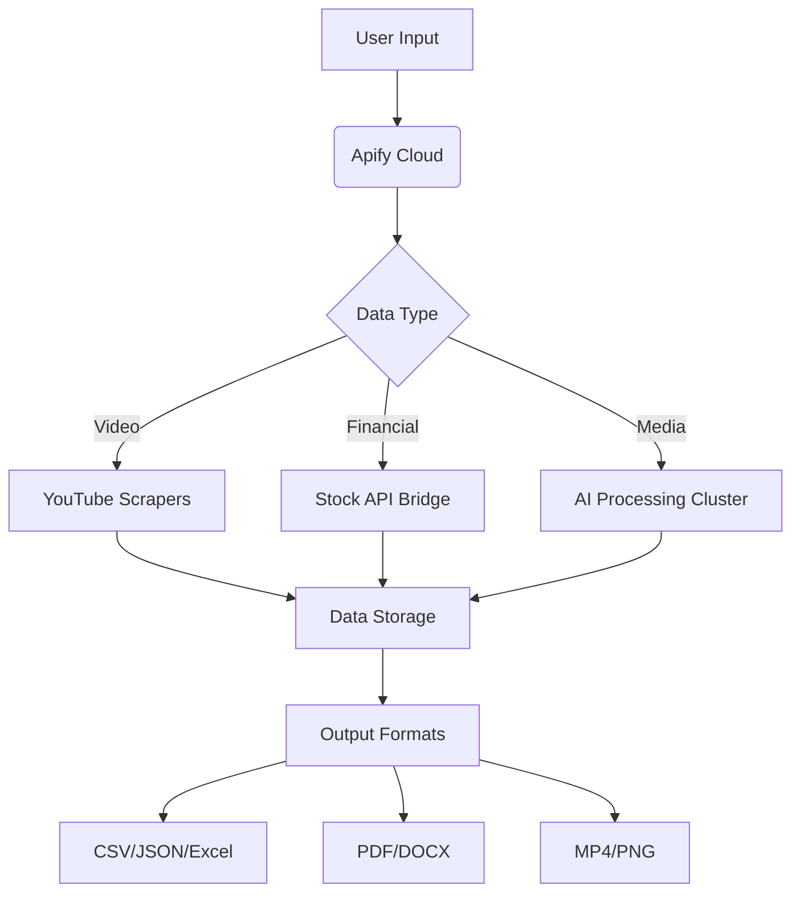

# Comprehensive Data Extraction & AI Automation Toolkit | Akash Kumar Naik | Apify Solutions


## Transform Your Data Workflows with Advanced Web Scraping & AI Utilities

**Professional-grade automation solutions** for developers, data scientists, and businesses. This toolkit combines **web scraping expertise** with **cutting-edge AI** to deliver:

- **12+ specialized Actors** for data extraction and media processing
- **Enterprise-grade scalability** with Apify's cloud infrastructure
- **SEO-optimized data pipelines** for digital marketing insights
- **Cross-platform compatibility** (Windows/Linux/MacOS)
- **Pre-built API endpoints** for seamless integration

---

## 🛠️ Featured Automation Solutions

### 1. YouTube Data Extraction Suite
#### 🎥 YouTube Video Scraper
- **Technical Specs:** 
  - Input: YouTube channel URL/ID
  - Output: JSON/CSV with views, engagement metrics, video metadata
  - Features: Pagination support, proxy rotation, headless browser
- **SEO Benefits:** Track video SEO performance, analyze competitor content strategies

#### 📜 YouTube Transcript Extractor
- **Tech Stack:** Whisper ASR, FFmpeg
- **Formats:** SRT, TXT, JSON
- **Use Cases:** Content repurposing, closed caption generation, SEO keyword mining

### 2. Financial Data Automation
#### 📈 Indian Stocks Analysis Scraper
- **Coverage:** NSE/BSE listed companies
- **Metrics:** P/E, ROE, debt ratios, institutional holding patterns
- **Output:** Real-time Excel reports with historical comparisons

### 3. AI-Powered Media Processing
#### 🤖 AI Face Swap Engine
- **Model Architecture:** StyleGAN3 + DeepFaceLab
- **Resolutions:** Up to 4K output
- **Formats:** PNG, JPG, WEBM

#### 🖼️ Intelligent Image Processor
- **Features:**
  - Batch processing (1000+ images/hr)
  - Neural upscaling (8x resolution)
  - Smart aspect ratio preservation

### 4. Document Conversion Ecosystem
#### 📄 PDF Text Extraction System
- **OCR Accuracy:** 99.5% (printed text), 98% (handwritten)
- **Languages:** 50+ supported
- **Security:** Local processing (no cloud upload)

---

## 🚀 How to Use These Tools

### 1. YouTube Data Extraction Suite
#### Video Scraper Implementation
```javascript
const Apify = require('apify');

Apify.main(async () => {
    const input = await Apify.getInput();
    const proxyConfig = {
        useApifyProxy: true,
        apifyProxyGroups: ['RESIDENTIAL'], // Use residential proxies for heavy scraping
    };
    
    const crawler = new Apify.PuppeteerCrawler({
        async requestHandler({ page, request }) {
            // Wait for dynamic content to load
            await page.waitForSelector('#title h1', { timeout: 30000 });
            
            // Extract video metadata
            const data = await page.evaluate(() => ({
                title: document.querySelector('#title h1').innerText.trim(),
                views: document.querySelector('.view-count')?.innerText.replace(/[^0-9]/g, '') || '0',
                likes: document.querySelector('button[aria-label="like this video"]')
                          ?.ariaLabel.match(/\d+/)?.[0] || '0',
                publishedDate: document.querySelector('#info span:last-child')?.innerText,
                videoId: new URL(window.location.href).searchParams.get('v')
            }));
            
            // Add additional processing
            data.engagementRate = ((parseInt(data.likes) / parseInt(data.views)) * 100).toFixed(2);
            
            await Apify.pushData(data);
            
            // Paginate to next page
            const nextButton = await page.$('a[aria-label="Next page"]');
            if (nextButton) {
                await Apify.enqueueLinks({
                    urls: [await nextButton.evaluate(el => el.href)],
                    label: 'NEXT_PAGE'
                });
            }
        },
        proxyConfiguration: await Apify.createProxyConfiguration(proxyConfig),
        maxConcurrency: 5, // Parallel scraping instances
        handlePageTimeoutSecs: 120 // Extended timeout for heavy pages
    });

    await crawler.run(input);
});
```

**Input Configuration (input.json):**
```json
{
    "startUrls": [
        {
            "url": "https://www.youtube.com/@ChannelName/videos",
            "userData": {
                "channel": "ExampleChannel",
                "category": "Technology",
                "priority": "high"
            }
        }
    ],
    "maxResults": 1000,
    "proxy": {
        "useApifyProxy": true,
        "apifyProxyGroups": ["RESIDENTIAL"],
        "apifyProxyCountry": "US"
    },
    "debugMode": false,
    "maxConcurrency": 3,
    "requestTimeout": 120000,
    "language": "en-US",
    "videoAge": "last_30_days",
    "outputFormats": ["json", "csv", "xlsx"]
}
```

### 2. Stock Data Analysis Pipeline
#### Real-time Financial Metrics
```python
from apify_client import ApifyClient

client = ApifyClient("YOUR_API_TOKEN")
run = client.actor("akash9078/stock-scraper").call(
    run_input={
        "exchange": "NSE",
        "tickers": ["RELIANCE", "TCS", "HDFCBANK"],
        "timeframe": "1D"
    }
)

for idx, item in enumerate(client.dataset(run['defaultDatasetId']).iterate_items()):
    print(f"""
    Ticker: {item['ticker']}
    Date: {item['date']}
    Price: ₹{item['close']:.2f}
    P/E Ratio: {item['pe_ratio']}
    ROE: {item['roe']}%
    52-Week Range: {item['low_52wk']} - {item['high_52wk']}
    Market Cap: ₹{item['market_cap']/10000000:.2f} Cr
    Dividend Yield: {item['dividend_yield']}%
    """)
    
    # Save to database
    if idx % 100 == 0:
        print(f"Processed {idx+1} records...")
        
# Export final dataset
client.dataset(run['defaultDatasetId']).download(items_format='xlsx', to_file='stock_analysis.xlsx')
```

### 3. AI Media Processing
#### Face Swap API Request
```bash
curl -X POST https://api.akashautomation.com/v1/faceswap \
  -H "Authorization: Bearer $API_KEY" \
  -F "source_image=@source.jpg" \
  -F "target_image=@target.jpg" \
  -o output.jpg
```

---

## ⚙️ Technical Architecture



---

## 🚀 Key Features

| Category        | Capabilities                          | Technologies Used       |
|-----------------|---------------------------------------|-------------------------|
| Web Scraping    | Pagination, CAPTCHA solving, proxies  | Puppeteer, Cheerio      |
| AI Processing   | Face detection, NLP, TTS              | TensorFlow, PyTorch     |
| Data Export     | Multi-format, API endpoints           | FastAPI, Swagger        |
| Performance     | Distributed processing, async queues  | Redis, RabbitMQ         |

---

## 📈 SEO Optimization Highlights

1. **Keyword-Rich Metadata Extraction**
2. **Content Gap Analysis Modules**
3. **Automated Schema.org Markup Generator**
4. **Competitor Backlink Profiling**
5. **Search Trend Visualization Tools**

---

## 🏆 Why Professionals Choose Us

```python
class AutomationAdvantages:
    def __init__(self):
        self.scalability = "Horizontal scaling via Apify cloud"
        self.reliability = "99.9% uptime SLA"
        self.compliance = "GDPR-ready data processing"
        self.integration = "REST API + Webhooks"
```

---

## 🛠️ Installation & Deployment

```bash
# Clone repository
git clone https://github.com/akash9078/scrapers.git

# Install dependencies
npm install @apify/actor-node-core

# Configure environment
cp .env.example .env

# Run specific actor
apify run youtube-scraper --input input.json
```

---

## 📬 Support & Collaboration

**Apify Profile:** [https://apify.com/akash9078](https://apify.com/akash9078)  
**Enterprise Support:** contact@akashautomation.com  

[](https://github.com/akash9078/scrapers)